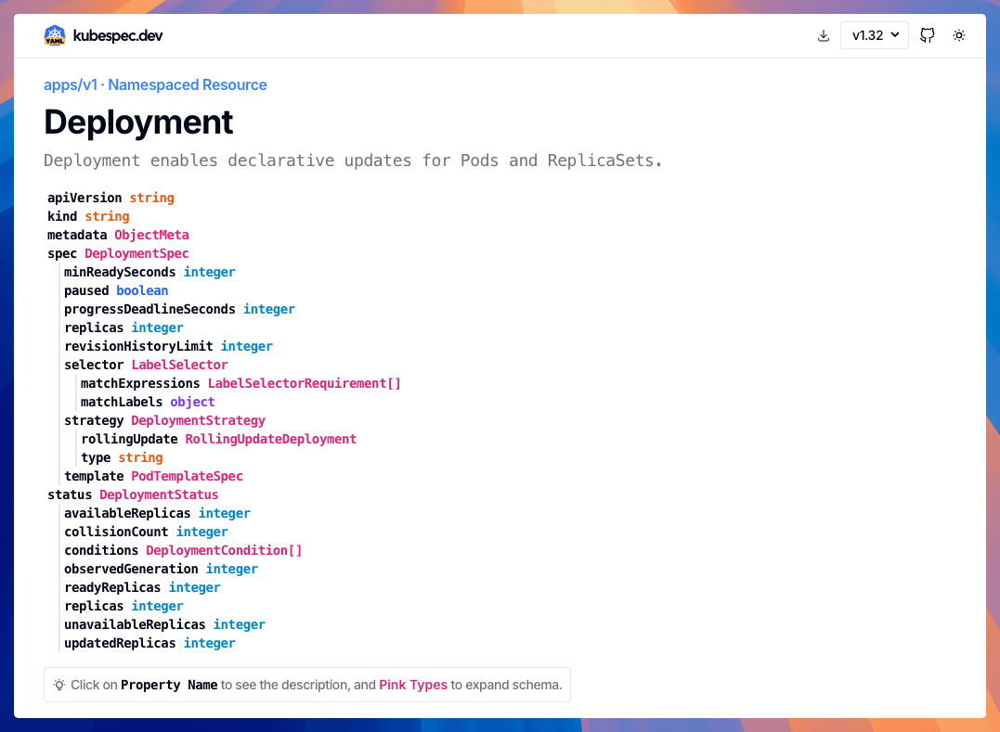

# Kubernetes Spec Explorer

👉 Live at https://kubespec.dev

- Tree view of all Kubernetes resources
- History changes since Kubernetes v1.12
- Examples that you can use copy and modify
- Links to official Kubernetes documentation and useful resources
- Support for popular CRDs

## Contributing

Contributions are welcome!

### Prepare

- clone the repo
- run `npm install`

### Run the explorer

- run `npm run dev`

### Add new projects

- add new projects to `src/lib/kube/projects.js`
- run `npm run download` (i)
- run `npm run build`

(i) A GitHub Access Token is required. Please set the `GH_TOKEN` environment variable.

## 📃 License

MIT

## ❤️ Sponsored by

---

## SBT customisations

1. [x] add new projects
1. [x] add examples under CRD page
1. [ ] fix "releaseFileName" error during build (scripts/download.ts, line 123)
1. [ ] containerise
1. [ ] customise what's necessary to deploy in our environment
1. [ ] customise "filterTag" to set something like ">= version"
1. [ ] customise "filterTag" to take values from env-var at build time
1. [ ] include/exclude CRDs via env-var
1. [ ] customise version dropdown to show the version of the project (instead of always k8s version)
1. [x] move "change history" at the end of the page
1. [x] collapse all examples
1. [ ] expand all subproperties with shift+click
