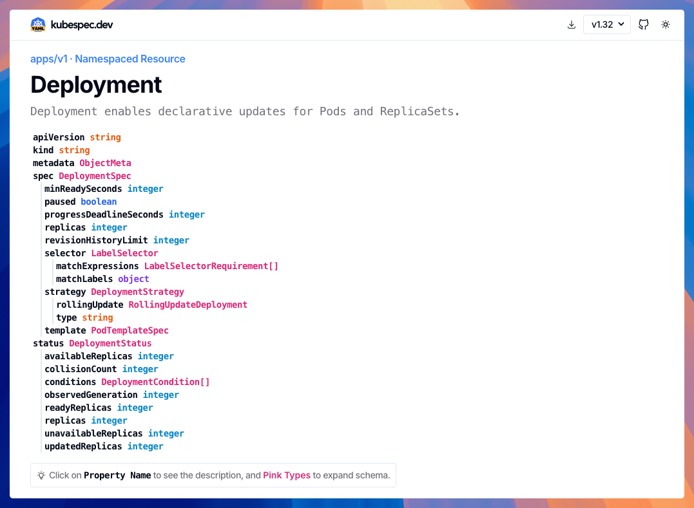

# Kubernetes Spec Explorer

👉 Live at https://kubespec.dev

- Tree view of all Kubernetes resources
- History changes since Kubernetes v1.12
- Examples that you can use copy and modify
- Links to official Kubernetes documentation and useful resources
- Support for popular CRDs

## Contributing

Contributions are welcome!

- clone the repo
- run `npm install`
- run `npm run dev`

### Adding a new project (source of CRD specs)

- add a new entry at the end of the list of projects in `src/lib/kube/projects.ts`
- run `npm run download -- --project-slug="<slug>"` to download the defined CRD spec's for that project
- create a pull request

### Update all projects or one specific project

- run either of the following
  - `npm run download` to update all projects
  - `npm run download -- --project-slug="<slug>"` to update a specific project
- create a pull request

## 📃 License

MIT

## ❤️ Sponsored by

